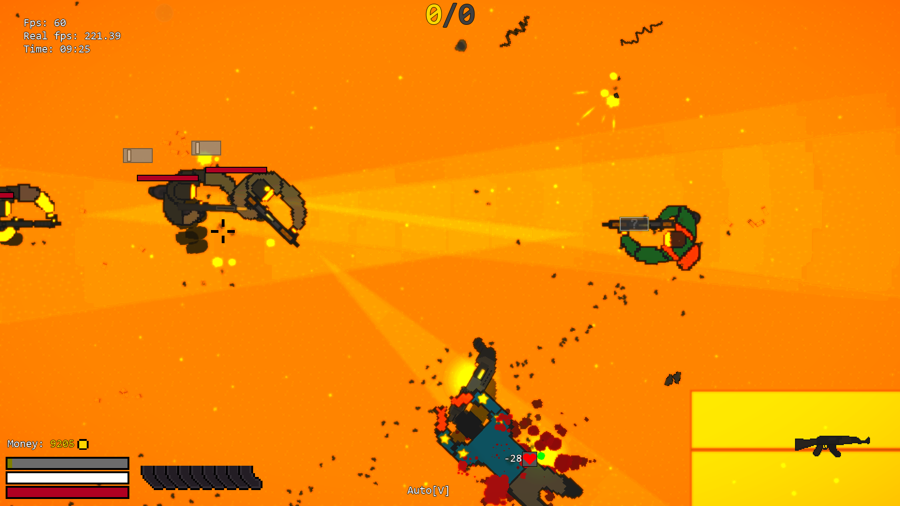
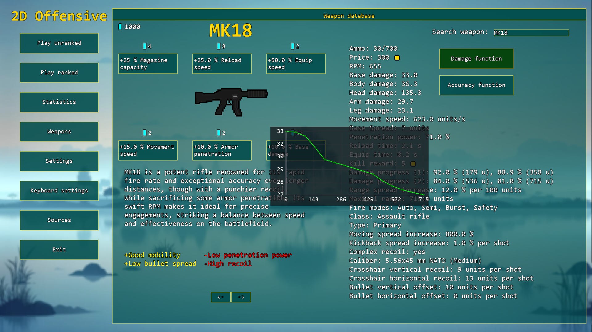
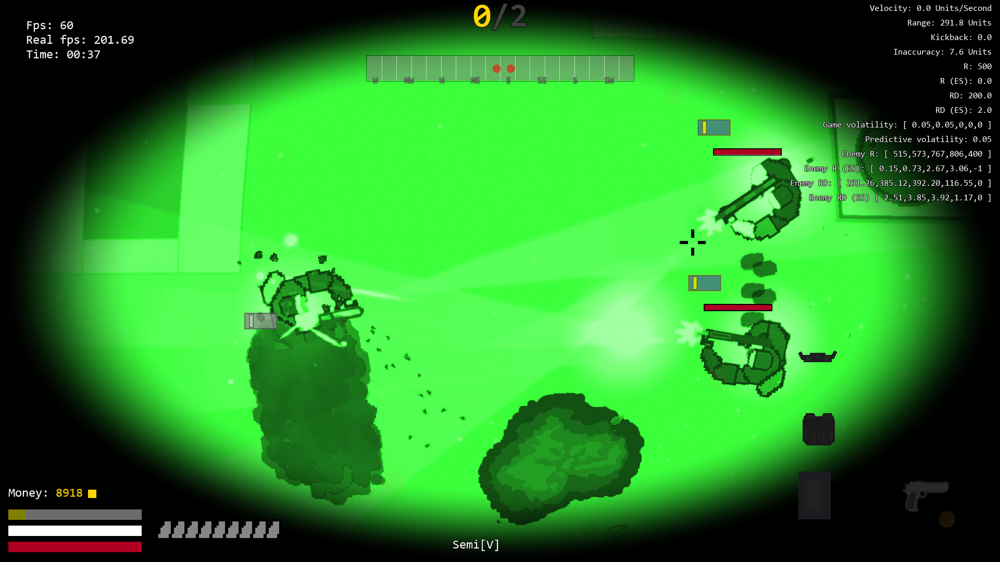

# 2D Offensive

2D Offensive is a small hobby 2D top-down shooter project being developed in GameMaker Studio 2.3.

It takes some inspiration from my favourite games like Counter-Strike, CS2D and Unturned.

<p align="center">
  
  
</p>

<p align="center">
  
</p>

<p align="center">
  <em>Early WIP gameplay, weapon menu and night vision examples.</em>
</p>

## Gameplay Idea

The idea of the game is built around hitboxes, aiming, weapon skill, movement, and making individual weapons feel different from each other.

The goal is not just to make a simple top-down shooter where every gun feels the same, but to experiment with weapon handling, different weapon stats, player movement, and combat that depends at least a bit on aim and positioning (strong CS inspiration).

One of the main experiments is a kind of "3D aiming" system. Bullets do not simply travel as a perfect 2D line from the player through the crosshair. Instead, shots are spread around the crosshair in 2D space, somewhat closer to how weapon inaccuracy works in FPS games but in 2D. The player's position and aim direction still matter, but the final shot placement depends on weapon accuracy, movement, recoil, spread, and where the crosshair is pointing. This mechanic is main reaason why aim and hitboxes matter.

## Project Status

This project is very WIP and should be treated more like a public archive.

It is a personal hobby project, and it will most likely never be fully finished. Expect unfinished systems, experimental code, placeholder content and old ideas.

## Current Content

There are no real finished levels, campaign or progression.

Right now the project mostly contains a couple of test rooms used for implementing and testing whatever systems or ideas I felt like adding for fun and experimentation.

## Disclaimer

This project was created purely as a personal hobby project. The source code and project files are provided as is, without any warranty that they are complete, stable, secure, optimized, or suitable for any serious use.

The author takes no responsibility for any issues caused by using, modifying, or building this project. This repository should be treated as an unfinished development archive and a loose source of ideas.

Some assets, code, or resources may come from third-party sources. Credits and sources are listed in the Sources tab in the main menu.

## Known Requirements

- GameMaker IDE v2023.8.0.98
- GameMaker project format 2.3+
- Graphics drivers/GPU support for GameMaker shaders
- DirectX 11 for older Windows versions (shaders)

Newer GameMaker versions may be able to open the project, but the project was developed using IDE v2023.8.0.98.

## Opening the Project

Open the project file:

```text
2D_Offensive.yyp
```

in GameMaker Studio 2.3+ IDE.

## Notes

- This project includes code, objects, sprites, sounds, shaders, rooms, and other GameMaker resources.
- Things may be messy in places. As I said, the main idea behind the project is learning, experimenting and fun.
